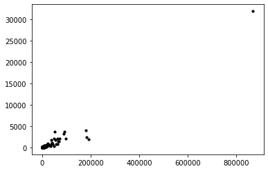
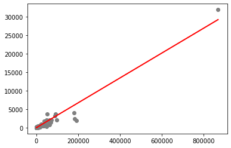

# Tarefa 1: Aprendizado Supervisionado

**Autor**: Matheus Jericó Palhares <br>
**LinkedIn**: https://linkedin.com/in/matheusjerico <br>
**Github**: https://github.com/matheusjerico

### 1) Tarefa: implementar a função “fit_linear_regression(pontos)”. Retorne os valores de m e de a.

**Variáveis**:
- pontos: conjunto de pontos 2D (casos x mortes) que serão clusterizados
- Desafio: pesquise sobre como realizar regressão linear para casos com 3 dimensões (2 features e 1 target) e implemente a função fit_linear_regression_3D(pontos).


O seu relatório será o notebook exportado para um arquivo HTML e deve conter:
- Um scatter plot mostrando os pontos e a linha estimada na regressão.
- Calcule o R2 e discorra sobre o quão boa foi a sua aproximação, sugerindo possíveis formas de melhorar o seu modelo.
- Compare os seus resultados com os obtidos através do sklearn.linear_model.LinearRegression. Eles deveriam ser iguais.

### 1. Bibliotecas


```python
import numpy as np
import matplotlib.pyplot as plt
import pandas as pd
import random as rd
from sklearn.linear_model import LinearRegression
from sklearn.metrics import mean_squared_error
```

### 2. Carregando dados


```python
dataset = pd.read_csv("./Dataset/base-covid-19-us.csv")
dataset.head()
```


<div>
<table border="1" class="dataframe">
  <thead>
    <tr style="text-align: right;">
      <th></th>
      <th>county</th>
      <th>cases</th>
      <th>deaths</th>
    </tr>
  </thead>
  <tbody>
    <tr>
      <th>0</th>
      <td>Abbeville</td>
      <td>84</td>
      <td>0</td>
    </tr>
    <tr>
      <th>1</th>
      <td>Acadia</td>
      <td>741</td>
      <td>21</td>
    </tr>
    <tr>
      <th>2</th>
      <td>Accomack</td>
      <td>116</td>
      <td>0</td>
    </tr>
    <tr>
      <th>3</th>
      <td>Ada</td>
      <td>4264</td>
      <td>41</td>
    </tr>
    <tr>
      <th>4</th>
      <td>Adair</td>
      <td>325</td>
      <td>8</td>
    </tr>
  </tbody>
</table>
</div>


```python
dataset.shape
```


    (1570, 3)


```python
dataset.sort_values(by=['deaths'], inplace=True)
```


```python
cases = dataset['cases'].values
deaths = dataset['deaths'].values
plt.scatter(cases, deaths, c='black', s=10)
```


    <matplotlib.collections.PathCollection at 0x7f80aaa245c0>





### 3. Criando classe da Regressão Linear


```python
class linearRegression:
    def __init__(self, pontos):
        self.pontos = pontos
        self.X = self.pontos['cases'].values
        self.Y = self.pontos['deaths'].values
        self.n = len(self.X)
        self.x_media = 0
        self.y_media = 0
        
    def fit(self):
        self.x_media = np.mean(self.X)
        self.y_media = np.mean(self.Y)

        numerador = 0
        denominador = 0
        for i in range(self.n):
            numerador += (self.X[i] - self.x_media) * (self.Y[i] - self.y_media)
            denominador += (self.X[i] - self.x_media) ** 2

        self.m = numerador / denominador
        self.a = self.y_media - (self.m * self.x_media)

        return (self.m, self.a)
    
    def plot(self):
        x_max = np.max(self.X) + 100
        x_min = np.min(self.X) - 100

        x = np.linspace(x_min, x_max, 1000)
        y = self.a + self.m * x
        
        plt.plot(x, y, color='#00ff00', label='Linear Regression')
        plt.scatter(self.X, self.Y, color='#ff0000', label='Data Point')
        plt.xlabel('Cases')
        plt.ylabel('Deaths')
        plt.legend()
        plt.show()
        
    def rmse(self):
        self.rmse = 0
        for i in range(self.n):
            y_pred =  self.a + (self.m * self.X[i])
            self.rmse += (self.Y[i] - y_pred) ** 2

        self.rmse = np.sqrt(self.rmse/self.n)
        return self.rmse
    
    def r2(self):
        self.sumofsquares = 0
        self.sumofresiduals = 0
        self.score = 0 
        
        for i in range(self.n) :
            y_pred = self.a + (self.m * self.X[i])
            self.sumofsquares += (self.Y[i] - self.y_media) ** 2
            self.sumofresiduals += (self.Y[i] - y_pred) **2

        self.score  = 1 - (self.sumofresiduals/self.sumofsquares)
        return self.score
```

### 4. Regressão Linear


```python
lRegression = linearRegression(dataset)
m, a = lRegression.fit()
```

#### 4.1. Coeficientes


```python
print(f'Coeficiente "m": {m}\nCoeficiente "a": {a}')
```

    Coeficiente "m": 0.033631581834363655
    Coeficiente "a": -18.63012262250561


#### 4.2. Gráfico


```python
lRegression.plot()
```


#### 4.3. RMSE


```python
lRegression.rmse()
```


    198.486116140131


#### 4.4. R2


```python
lRegression.r2()
```


    0.9444904768158006


**Análise:** 
- O modelo obteve um bom valor de R². 
- R² = 0.94 significa que o modelo linear explica 94% da variância da variável dependente a partir do regressores (variáveis independentes) incluídas naquele no modelo apresentado linear. 

**Possíveis melhoras:**
- Aumentar o volume de dados.
- Aumentar a quantidade de variáveis independentes.

### 5. Comparando com o modelo do Sklearn


```python
X = dataset['cases'].values.reshape(-1,1)
y = dataset['deaths'].values.reshape(-1,1)


reg = LinearRegression().fit(X, y)
reg.score(X, y)

print(f'Coeficiente "m": {reg.coef_[0][0]}\nCoeficiente "a": {reg.intercept_[0]}')
```

    Coeficiente "m": 0.03363158183436364
    Coeficiente "a": -18.630122622505567


```python
rmse = mean_squared_error(y, reg.intercept_[0]+(reg.coef_[0][0]*X), squared = False)
print(f'RMSE: {rmse}')
```

    RMSE: 198.48611614013106


```python
plt.scatter(X, y,  color='gray')
plt.plot(X,(reg.intercept_[0]+(reg.coef_[0][0]*X)), color='red', linewidth=2)
plt.show()
```





**Análise:**
- O resultado obtido através da nossa classe de regressão linear é igual ao resultado da classe de regressão linear do scikit-learn. 
