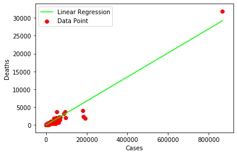

# Tarefa 1: Aprendizado Supervisionado

**Autor**: Matheus Jericó Palhares  
**LinkedIn**: https://linkedin.com/in/matheusjerico  
**Github**: https://github.com/matheusjerico

### 1) Tarefa: implementar a função “fit_linear_regression(pontos)”. Retorne os valores de m e de a.

**Variáveis**:
- pontos: conjunto de pontos 2D (casos x mortes) que serão clusterizados
- Desafio: pesquise sobre como realizar regressão linear para casos com 3 dimensões (2 features e 1 target) e implemente a função fit_linear_regression_3D(pontos).

O seu relatório será o notebook exportado para um arquivo HTML e deve conter:
- Um scatter plot mostrando os pontos e a linha estimada na regressão.
- Calcule o R2 e discorra sobre o quão boa foi a sua aproximação, sugerindo possíveis formas de melhorar o seu modelo.
- Compare os seus resultados com os obtidos através do sklearn.linear_model.LinearRegression. Eles deveriam ser iguais.

#### 1. Scatter Plot resultante da implementação do Algorítimo de Regressão Linear

#### 2. R2 Score

    0.9444904768158006

**Análise:** 
- O modelo obteve um bom valor de R². 
- R² = 0.94 significa que o modelo linear explica 94% da variância da variável dependente a partir do regressores (variáveis independentes) incluídas naquele no modelo apresentado linear. 

**Possíveis melhoras:**
- Aumentar o volume de dados.
- Aumentar a quantidade de variáveis independentes.

### 3. Comparando com o modelo do Sklearn

#### 3.1. RMSE do Algorítmo Scratch

    198.486116140131

#### 3.2. RMSE do Algorítmo Scikit-Learn

    198.48611614013106

**Análise:**
- O resultado obtido através da nossa classe de regressão linear é igual ao resultado da classe de regressão linear do scikit-learn. 
